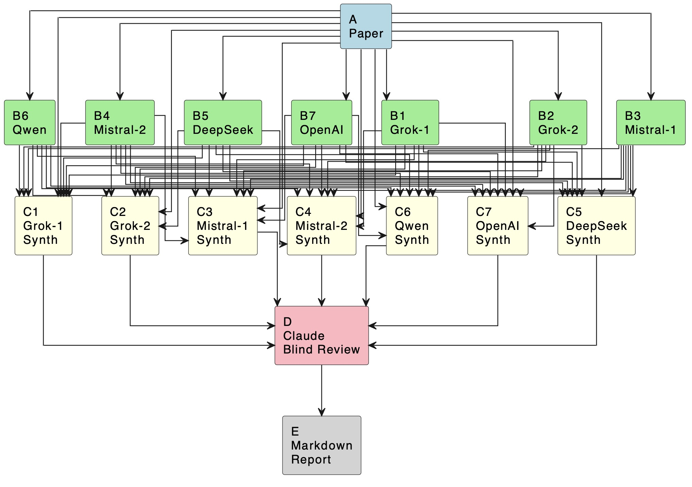

# Blind Multi-Model Self-Review for Draft Papers

<!-- https://plg.uwaterloo.ca/~migod/research/beckOOPSLA.html ) -->

### Abstract

Academic authors often need early, reliable feedback while a paper is only 70–80% complete, yet current AI review systems tend to hallucinate or reflect the biases of a single model. We propose a three-level architecture: seven heterogeneous models provide independent analyses (Level 1); each model then synthesizes its own view with the others’ critiques and the paper itself (Level 2); finally, a separate model produces a blind meta-review using only these syntheses, not the original text (Level 3). This structure separates independence, cross-model integration, and unbiased critique. The result is pre-submission feedback that highlights strengths, weaknesses, and—critically—missing elements that no single model would detect, giving authors actionable insights while revisions are still possible.

## 1. Overview
When writing a report, there is a tendecy to explain strengths of the report, to try and cover its weaknesses, and finding missing aspects for a specific area can be really hard to discover. At least, that has been my own experience.

In this report I will call those three aspects for SWM, strengths, weaknesies, and missing aspects.

So the key of this report is what I have done to get some help in spotting these issues before the report is actually handed in. 

In essence, I ask an AI to tell me what is sees in those three areas. And I have then written a experimental tool where you hand in the preliminary report, and ask it to response the SWM.

To highten the quality of the SWM, what is actually done is these items:

0. The paper is given to the system
1. A number of AI models are asked to read the paper, and summerize their SWM view
2. The same AI models are then given all the SWM responces, and then rewerite the SWM, but this time try to read both the paper and the N responses already written
3. Finally, a single AI which was not part of the list is asked to read the SWM responses. This level do not have access to the underlying paper to enforce a pure summary of the SWM responses.

At present, the 1. and 2. AI models are these 7:
> Grok: grok-code-fast-1, Grok: grok-4-fast-reasoning, Mistral: codestral-latest, Mistral: devstral-medium-2507, Together: Qwen/Qwen3-235B-A22B-Thinking-2507, Together: deepseek-ai/DeepSeek-V3.1, OpenAI: gpt-5.1

And the one mentioned in 3. is 
> Claude: claude-sonnet-4-20250514.

Foo

